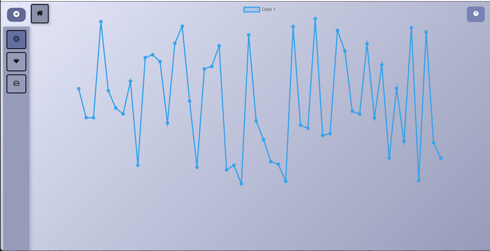

# Dashboard monitor

## Teknologi

1. chart.js & react-chartjs-2 => untuk menggambar grafick

## Screenshot

## package manager pnpm

hasil kompilasi ke code html,js.css akan di kirim ke server untuk di handle

## skenario

2. Network
   dalam sistem pemantauan jaringan, data **download** dan **upload** yang dikumpulkan dari perangkat client menggambarkan aktivitas jaringan yang sedang berlangsung. Nilai download menunjukkan seberapa banyak data yang diterima oleh client dari internet dalam satu detik, misalnya saat streaming video, mengakses website, atau mengunduh file. Sebaliknya, nilai upload menunjukkan seberapa banyak data yang dikirimkan oleh client ke jaringan, seperti saat mengunggah dokumen, melakukan panggilan video, atau mengirimkan data ke server.

Sistem hanya mengambil data dari antarmuka jaringan yang aktif seperti `wlan0` untuk koneksi WiFi atau `eth0` untuk koneksi kabel LAN, dan mengabaikan antarmuka yang tidak relevan seperti `lo` (loopback). Dengan begitu, data yang ditampilkan mencerminkan kondisi nyata koneksi internet yang digunakan oleh client. Kecepatan download dan upload ini dihitung dalam Mbps (Megabit per second), yang merupakan standar dalam mengukur performa internet. Melalui informasi ini, sistem dapat menunjukkan **seberapa cepat koneksi internet yang sedang digunakan oleh client**, serta apakah jaringan sedang sibuk, lambat, atau lancar dalam menangani lalu lintas data.

D
